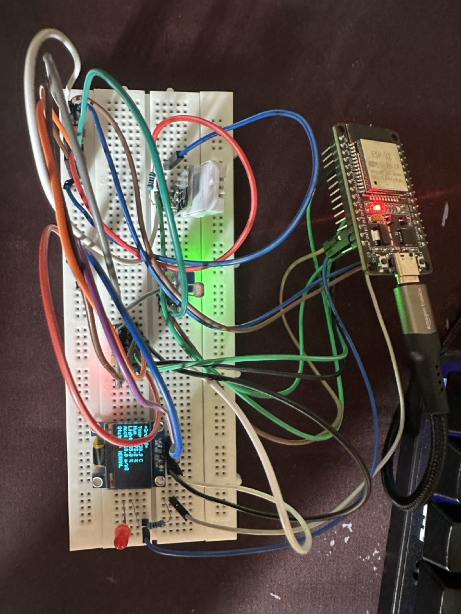
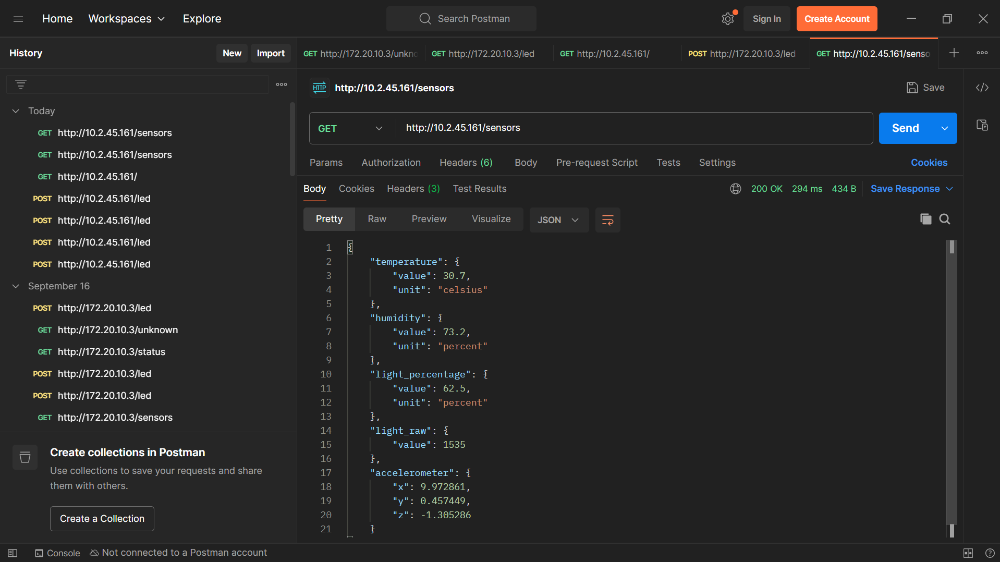
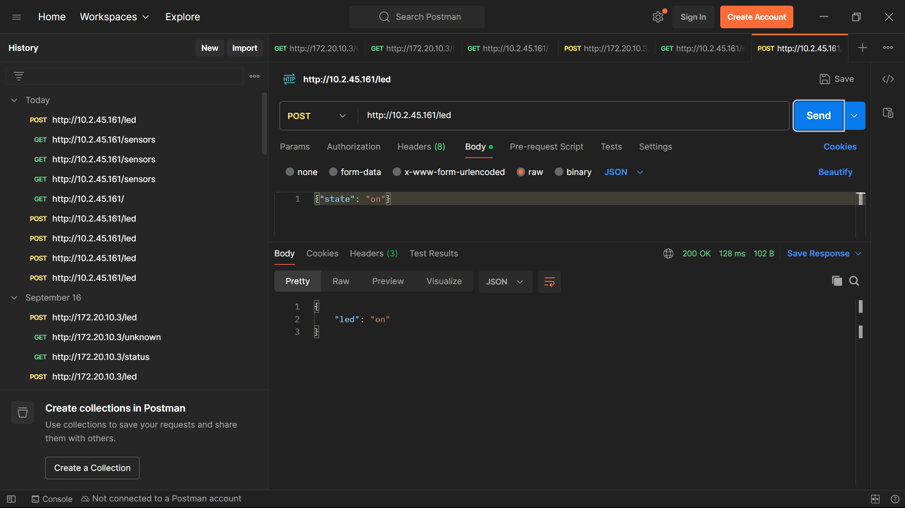
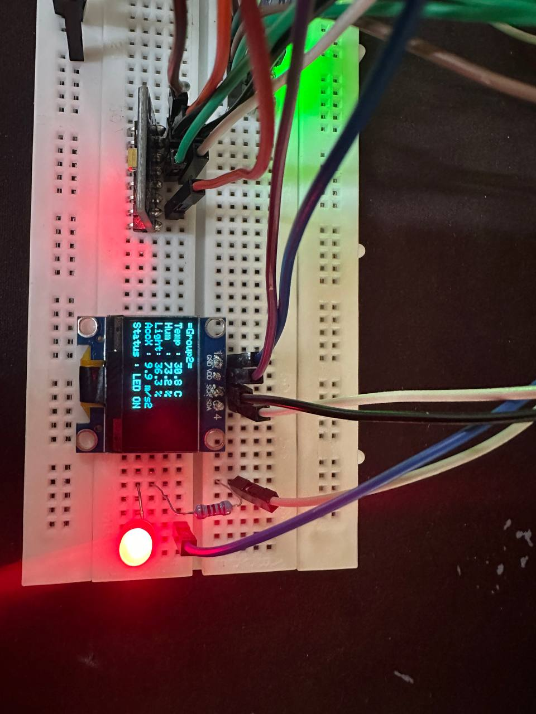
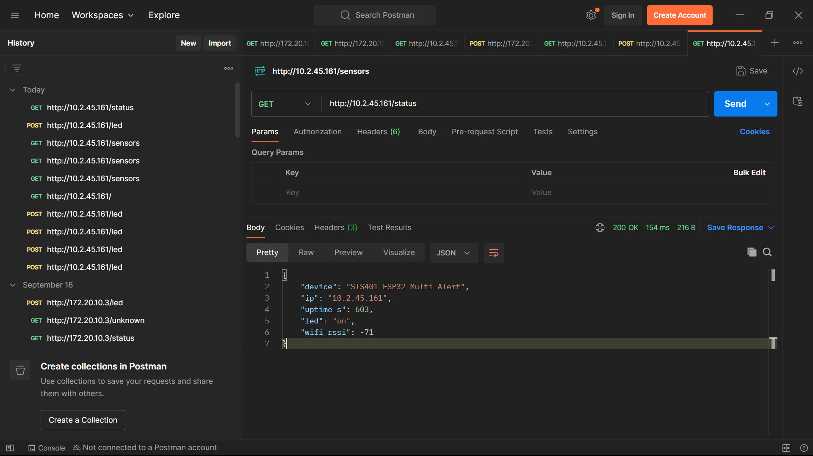
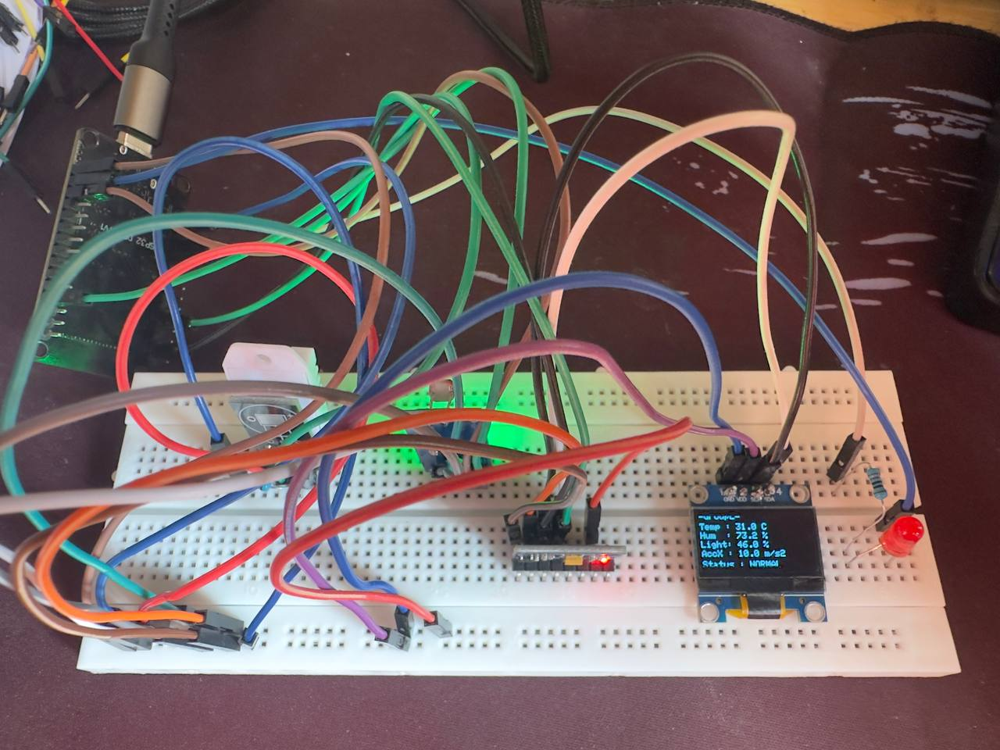
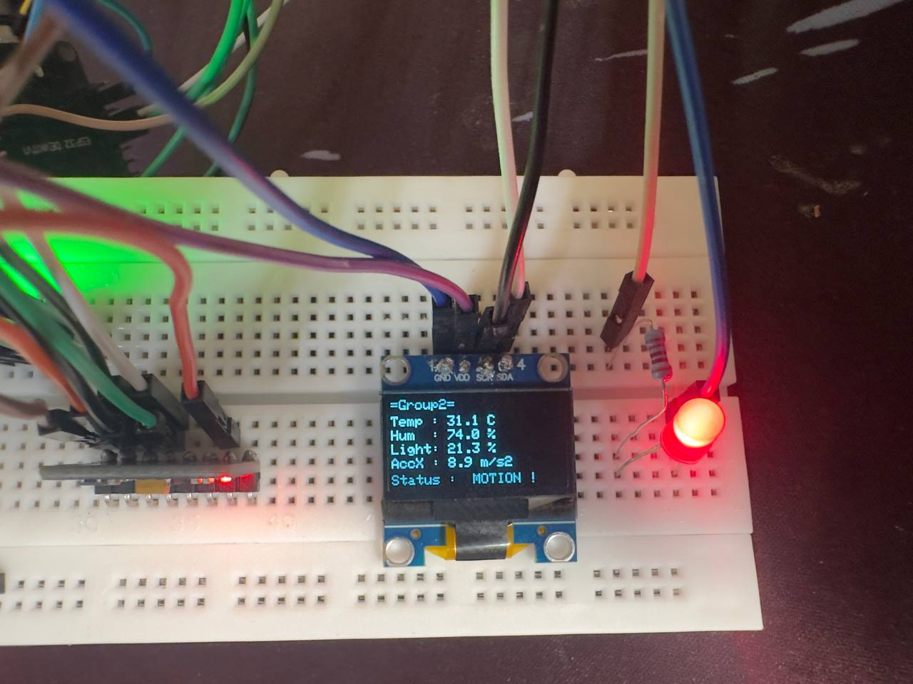
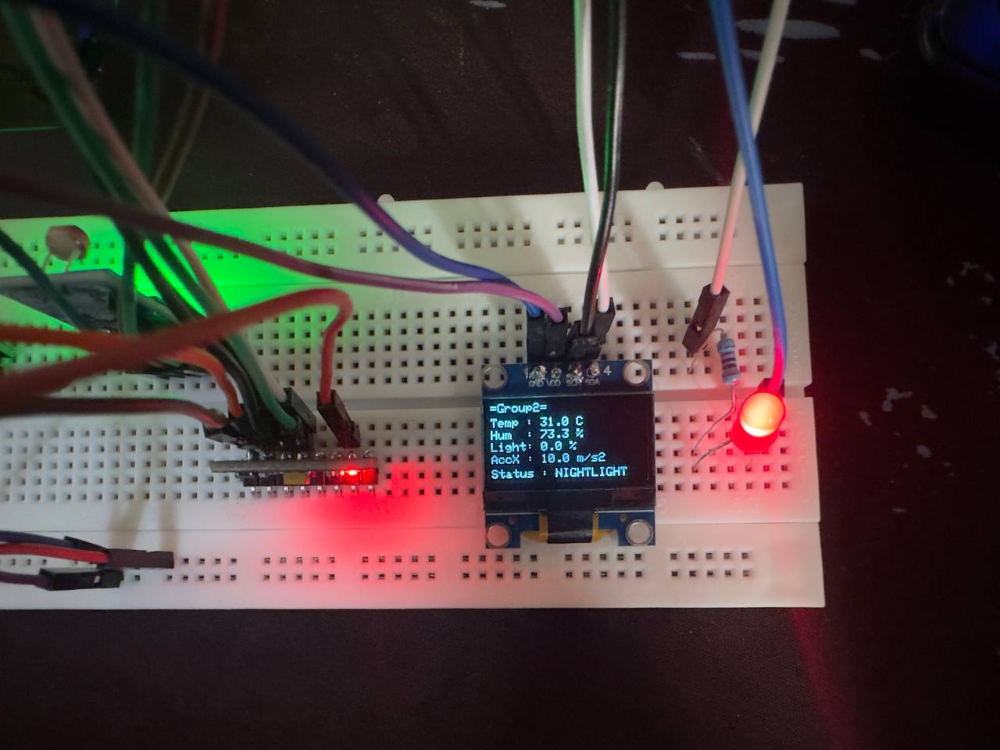
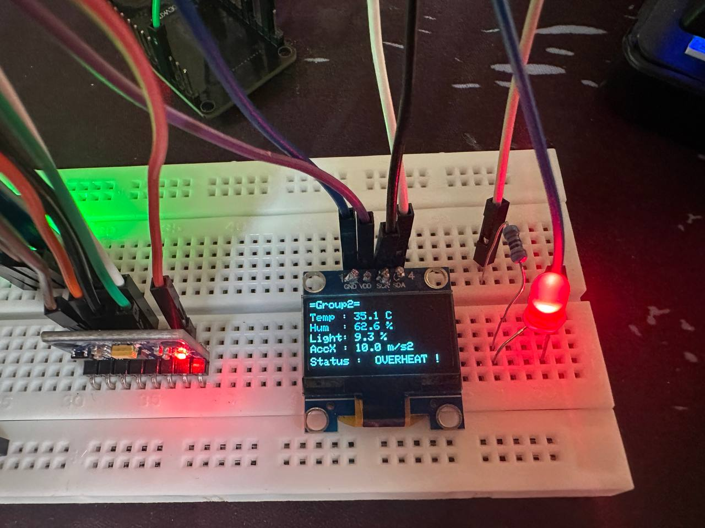

## Circuit Setup Photo


## API Verification

GET http://<ESP32_IP>/sensors



POST http://<ESP32_IP>/led request sending {"state": "on"} and receiving a 200 OK response.





Screenshot of a GET http://<ESP32_IP>/status request showing device uptime, IP, and Wi-Fi RSSI.



## OLED Visual Alert Verification

Normal State: Showing structured rows for Temp, Hum, Light %, AccX, and STAT: NORMAL.



Alert States: Showing active threshold overrides. 

1. MOTION !



2. NIGHTLIGHT




3. OVERHEAT !



Here is the component pinout mapping table formatted in Markdown:

### Component Pinout Mapping Table

| Component | Component Pin | ESP32 GPIO Pin | Description / Notes |
| --- | --- | --- | --- |
| **SSD1306 OLED** | VCC | 3.3V | Power (3.3V) |
|  | GND | GND | Ground |
|  | SDA | GPIO 21 | I2C Data Line |
|  | SCL | GPIO 22 | I2C Clock Line |
| **MPU6050 (Clone)** | VCC | 3.3V | Power (3.3V) |
|  | GND | GND | Ground |
|  | SDA | GPIO 21 | Shared I2C Data Line |
|  | SCL | GPIO 22 | Shared I2C Clock Line |
| **DHT22** | VCC | 3.3V or 5V | Power supply |
|  | DATA | GPIO 4 | Digital Single-Wire Data |
|  | GND | GND | Ground |
| **LDR Module** | VCC | 3.3V | Power supply |
|  | AO (Analog Out) | GPIO 34 | Analog ADC1 Input |
|  | GND | GND | Ground |
| **External LED** | Anode (+) Long Leg | GPIO 2 | Connected via 220Ω resistor |
|  | Cathode (-) Short Leg | GND | Ground connection |


## System Overview

This IoT Monitoring System uses an ESP32 microcontroller as a centralized local HTTP web server. It continuously polls environmental and physical sensors, calculates threat states based on a priority hierarchy, outputs real-time visual feedback on an OLED display, and exposes structured JSON endpoints over a local Wi-Fi network.

Here is your complete documentation formatted cleanly in Markdown:

# ESP32 IoT Monitoring System Documentation

## Key Components & Protocols

### 1. Sensors & Actuators Used

* **DHT22:** Reads ambient Temperature (°C) and Relative Humidity (%).
* **LDR (Light Dependent Resistor Module):** Measures light intensity, normalized to a 0%–100% scale.
* **MPU6050 (Accelerometer/Gyroscope):** Tracks physical motion and motion vectors ($\text{m/s}^2$).
* **SSD1306 OLED Display (128x64, $\text{I}^2\text{C}$):** Displays structured sensor rows and system status.
* **LED (with $220\,\Omega$ resistor):** Provides visual alarms based on priority thresholds or manual control.

### 2. Wireless Protocol

* **Wi-Fi (IEEE 802.11 b/g/n) via HTTP REST API (Port 80):**
* Replaces external brokers to avoid local network/firewall blocking.
* Serves structured JSON data accessible via any browser or Postman client on the same local network.


---

## System Functionality & Priority Logic

The ESP32 evaluates incoming sensor data against defined threshold logic in a prioritized hierarchy:

1. **Priority 1 (Motion Alert):** Triggered when accelerometer values shift ($\Delta \text{AccX} > 3.0\,\text{m/s}^2$). The LED flashes rapidly at **100ms** intervals, displaying `! MOTION !`.
2. **Priority 2 (Temperature Alert):** Triggered when temperature exceeds **$33.0\text{ °C}$**. The LED flashes at **500ms** intervals, displaying `! OVERHEAT !`.
3. **Priority 3 (Nightlight Mode):** Triggered when light level drops below **$35\%$**. The LED turns solid **ON**, displaying `NIGHTLIGHT`.
4. **Normal / Idle State:** When no thresholds are crossed, the display shows `NORMAL`. The LED state follows manual HTTP requests sent to the REST API.

---

## REST API Endpoint Reference

| Method | Endpoint | Description | Sample Output / Payload |
| --- | --- | --- | --- |
| **GET** | `/sensors` | Returns all current sensor metrics formatted in JSON | `{"temperature":{"value":30.8,"unit":"celsius"}, "light_percentage":{"value":78.2,"unit":"percent"}, ...}` |
| **POST** | `/led` | Controls manual LED state (active only when no alert is present) | **Request:** `{"state": "on"}`<br>

<br>**Response:** `{"led": "on"}` |
| **GET** | `/status` | Returns system health, Wi-Fi RSSI, local IP, and uptime | `{"device":"SIS401 ESP32 Multi-Alert", "ip":"10.2.45.161", "uptime_s":120, ...}` |

---

## Setup and Execution Guide

### Prerequisites

1. **Arduino IDE** installed with the ESP32 board package.
2. **Required Libraries** installed via Library Manager (`Sketch` > `Include Library` > `Manage Libraries`):
* `Adafruit SSD1306` & `Adafruit GFX Library`
* `DHT sensor library` by Adafruit
* `ArduinoJson` (v6 or higher)


### Step 1: Hardware Assembly

Connect components according to the pinout layout:

* **SSD1306 OLED & MPU6050:** Connect **SDA** to **GPIO 21** and **SCL** to **GPIO 22** (Shared $\text{I}^2\text{C}$ bus).
* **DHT22 Data:** Connect to **GPIO 4**.
* **LDR Analog Output (AO):** Connect to **GPIO 34**.
* **LED:** Connect **GPIO 2** through a $220\,\Omega$ resistor to the LED Anode (+), and Cathode (-) to **GND**.

### Step 2: Configure & Upload Code

1. Open the full code in Arduino IDE.
2. Update lines 15–16 with your local Wi-Fi credentials:
```cpp
const char* WIFI_SSID     = "WIFI_NAME";
const char* WIFI_PASSWORD = "WIFI_PASSWORD";

```


3. Connect your ESP32 via USB, select your board and COM port, and click **Upload**.

### Step 3: Run and Verify

1. Open the **Arduino Serial Monitor** (**115200 baud**).
2. Note the IP address printed upon Wi-Fi connection (e.g., `[http://10.2.45.161](http://10.2.45.161)`).
3. Verify operation:
* **In Browser:** Navigate to `http://<ESP32_IP>/sensors` to view live JSON readings.
* **In Postman:** Send a `POST` request to `http://<ESP32_IP>/led` with body `{"state": "on"}` to toggle the LED manually.
* **Sensor Testing:** Cover the LDR (Nightlight), warm the DHT22 (Overheat), or tilt the MPU6050 (Motion) to test automatic threshold overrides on the OLED and LED.